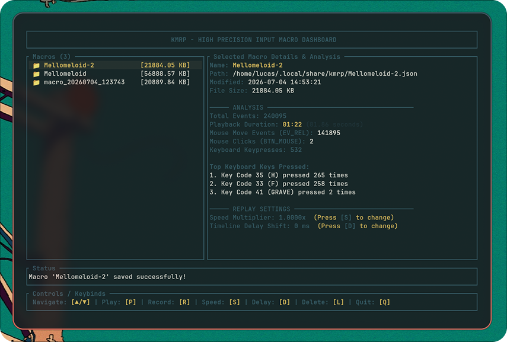

# kmrp



## what is kmrp?

kmrp is a shortened name for Keyboard Mouse Record Play
This is a program I made just to test how accurate you can get with recording

## testing

tested it in Osu! Lazer on Arch (LOGGED OUT) and didnt submit scores.
This was to benchmark long maps and see how accurate it would be.

## installation

if you wanna test yourself, you need rust and cargo.

run it by cloning repo

```bash
git clone git@github.com:lhagfoss/keyb_mouse_rp.git
```

then `cd` into the repo

```bash
cd keyb_mouse_rp
```

then install it

```bash
cargo install --path .
```

### you can now run it using these commands

to start record

```bash
kmrp record
```

to play it

```bash
kmrp play
```
